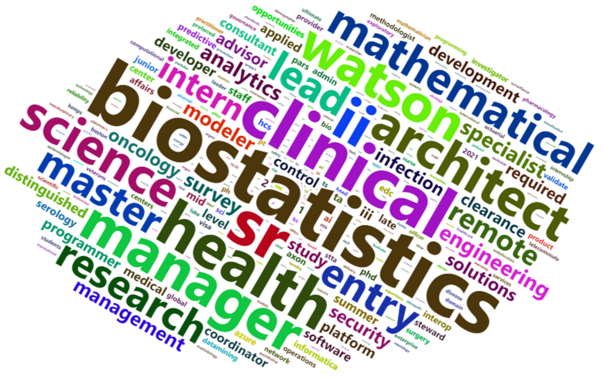

---
output:
  html_document: default
  pdf_document: default
---
---
title: "615 Final Report"
author: "Chun Gao"
date: "12/12/2020"
output: pdf_document
---

```{r setup, include=FALSE}
knitr::opts_chunk$set(echo = TRUE)
library(httr)
library(jsonlite)
library(tidyverse)
library(highcharter)
library(ggplot2)
library(magrittr)
library(tidytext)
library(wordcloud2)
library(leaflet)
library(dplyr)
```

# Introduction
Job seekers could find appropriate words to describe their skills and experience base on companies' descriptions of job vacancies. To give a clear display of description, we extracted relevant data from Job Board - Adzuna. From the data provided by Adzuna, we could roughly know the location distribution of job vacancy, the frequency of each vacancy's label. Besides, According to simple text analysis, we could find which words are frequently mentioned words.


# Data processing
Due to the API usage limitation, we used peers' accounts to extract the data. There were 4 data frames after performing the loop; we combined these data frames and deleted duplicate observations. To simplify the processing data progress, I saved the final data frame as a "raw_data" Rfile.
```{r eval=FALSE, echo=FALSE}
# this loop is inspired by peers
us <- list(NULL)
length(us) <-10
for (i in 1:length(us)) {
  url <- paste("https://api.adzuna.com/v1/api/jobs/us/search/1?app_id=8d18a3eb&app_key=2922ad916675255b6aa0fc02103828b8&results_per_page=50&what_phrase=data",sep = "")
  test <- fromJSON(url)
  us[[i]] <- test$results %>% 
    select("id","title","description","latitude","longitude","created","salary_is_predicted") %>%      mutate("company_name"=test$results$company$display_name) %>% 
    mutate("category_label"=test$results$category$label) %>% 
mutate("location"=test$results$location$display_name)
}
datatest <- do.call(rbind, us)
DF1 <- as.data.frame(datatest)

us <- list(NULL)
length(us) <-10
for (i in 1:length(us)) {
  url <- paste("https://api.adzuna.com/v1/api/jobs/us/search/",i,"?app_id=f0c87e31&app_key=84f049d50dd8aa26e2e48aff8ba0e61f&results_per_page=50&what_phrase=data&what_or=data%20scientce%20statistician",sep = "")
  test <- fromJSON(url)
  us[[i]] <- test$results %>% 
    select("id","title","description","latitude","longitude","created","salary_is_predicted") %>%      mutate("company_name"=test$results$company$display_name) %>% 
    mutate("category_label"=test$results$category$label) %>% 
mutate("location"=test$results$location$display_name)
}
datatest <- do.call(rbind, us)
DF2 <- as.data.frame(datatest)

us <- list(NULL)
length(us) <-10
for (i in 1:length(us)) {
  url <- paste("https://api.adzuna.com/v1/api/jobs/us/search/",i,"?app_id=ef69fa85&app_key=5c7fdcb5d0bca91c46054aabb9da8579&results_per_page=50&what_or=data%20scientce%20statistician",sep = "")
  test <- fromJSON(url)
  us[[i]] <- test$results %>% 
    select("id","title","description","latitude","longitude","created","salary_is_predicted") %>%      mutate("company_name"=test$results$company$display_name) %>% 
    mutate("category_label"=test$results$category$label) %>% 
mutate("location"=test$results$location$display_name)
}
datatest <- do.call(rbind, us)
DF3 <- as.data.frame(datatest)

us <- list(NULL)
length(us) <-10
for (i in 1:length(us)) {
  url <- paste("https://api.adzuna.com/v1/api/jobs/us/search/",i,"?app_id=ef69fa85&app_key=5c7fdcb5d0bca91c46054aabb9da8579&results_per_page=50&what_or=scientce%20statistician",sep = "")
  test <- fromJSON(url)
  us[[i]] <- test$results %>% 
    select("id","title","description","latitude","longitude","created","salary_is_predicted") %>%      mutate("company_name"=test$results$company$display_name) %>% 
    mutate("category_label"=test$results$category$label) %>% 
mutate("location"=test$results$location$display_name)
}
datatest <- do.call(rbind, us)
DF4 <- as.data.frame(datatest)

DF <- rbind(DF1,DF2,DF3,DF4)
df <- distinct(DF)
save(df,file = "D:/AA/Project 1/raw_data.Rdata")
```

```{r echo=FALSE}
load("D:/AA/Project 1/615_Final/raw_data.Rdata")
DF <- df
DF <- na.omit(DF)
DF <- DF[,-c(1,6,7)]
DF$title <- gsub("</strong>", "", DF$title)
DF$description <- gsub("</strong>", "", DF$description)
DF$title <- gsub("<strong>", "", DF$title)
DF$description <- gsub("<strong>", "", DF$description)
DF$description <- gsub("...  ", "", DF$description)
#DF$description <- gsub("[^[:alnum:]///' ]", "", DF$description)
```


# Frenquency Distribution of Different Job Label Categories

Based on the doughnut chart, almost half of the job vacancies related to data and statistics have "IT Jobs" labels(49.2%), followed by the "Scientific Job & QA Jobs", which accounts for 38.4% of the total. "Healthcare & Nursing Jobs", "Engineering Jobs" and "Admin Jobs" have similar percentages of about 2.6%.
```{r echo=FALSE, warning=FALSE, message=FALSE}
#load("D:/AA/Project 1/615_Final/DF_1.Rdata")
DF_1 <- distinct(DF)
a<-table(DF_1$category_label)
categorydist <- as.data.frame(a)
colnames(categorydist) <- paste(c("name","y"))
categorydist <- arrange(categorydist, desc(y))
highchart() %>% 
  hc_chart(type = "pie") %>% 
  hc_add_series(data = categorydist,
                innerSize = '60%',
                colorByPoint = TRUE) %>% 
  hc_tooltip(pointFormat = '{series.name}: <b>{point.percentage:.1f}%</b>') %>% 
  hc_title(text = 'Frenquency Distribution of Different Job Label Categories') %>% 
  hc_subtitle(text = "Plotted by CG") %>% 
  hc_add_theme(hc_theme_flat()) %>% 
  hc_plotOptions(pie = list(
    allowPointSelect = TRUE,
    cursor = 'pointer',
    dataLabels = list(
      enabled = T,
      format = '<b>{point.name}</b>: {point.percentage:.1f} %'
    ),
    showInLegend = T
  ))
```

# Mapping

We used package Leaflet to draw an interactive map marked with popups. Click the popups, and you can see the specific information of job vacancies(company, label, title, and job description). Besides, based on the distribution of popups, we know that job vacancies are relatively densely distributed in the US's mid-east region, especially on the east coast.

```{r message=FALSE, echo=FALSE, fig.align='center'}
DF_3 <- df
DF_3$title <- gsub("</strong>", "", DF_3$title)
DF_3$description <- gsub("</strong>", "", DF_3$description)
DF_3$title <- gsub("<strong>", "", DF_3$title)
DF_3$description <- gsub("<strong>", "", DF_3$description)
DF_3$description <- gsub("...  ", "", DF_3$description)
DF_3 <- na.omit(DF_3)
A <- DF_3[,-c(1,6,7,10)]
#https://rstudio.github.io/leaflet/popups.html
#https://www.zhihu.com/question/41230152
i_popup <- paste0("<strong>Company :  </strong>",A$company_name, "<br>", "<strong>Label :  </strong>",A$category_label, "<br>","<strong>Title :  </strong>",A$title,"<br>","<strong>Description :  </strong>",A$description) 

A%>%leaflet()%>%setView(lng=-100,lat=37.5,zoom=4)%>%addTiles()%>%
  addProviderTiles("Esri.WorldStreetMap")%>%
  addCircleMarkers(lng=~longitude,lat=~latitude,radius = 0.05,color = "Green",fill = TRUE)%>%           addMarkers(popup= i_popup)
```


# Word Cloud

Based on the frequency of words used in vacancies' description. "Business" and "clinical" are highly mentioned in the description, probably representing job seekers with business and clinical background have more opportunities to meet companies' requirements. Besides, "lead" is a high-frequency word in the vacancies' description, which might represent that applicants with lead experience would be preferred.
```{r message=FALSE, echo=FALSE,fig.align='center'}
DF_2 <- distinct(DF)
data(stop_words)
Meaningless_words <- tibble(word = c("data","statistician","statistical","statisticians",
                                    "support","building","analysis","job","provide","research","role"))
Description <- DF_2 %>%
  unnest_tokens(word, description) %>%
  anti_join(stop_words) %>%
  anti_join(Meaningless_words) %>%
  count(word, sort = TRUE)
#https://www.tidytextmining.com/tfidf.html?
wordcloud2(Description, size = 2, minRotation = -pi/6, maxRotation = -pi/6,  rotateRatio = 1)
#https://blog.csdn.net/jiyang_1/article/details/72179417
```

For the Wordcloud figure on vacancies' title. "Biostatistics" is a hot word in statistical job vacancies as well. The frequently used word "health" might represent a similar trend.
```{r eval=FALSE, echo=FALSE, fig.align='center'}
Meaningless_words1 <- tibble(word = c("data","statistician","statistical","statisticians", "support","building","analysis","job","provide","scientist","associate","statistics","analyst"))
Title <- DF_2 %>%
  unnest_tokens(word, title) %>%
  anti_join(stop_words) %>%
  anti_join(Meaningless_words1) %>%
  count(word, sort = TRUE)
wordcloud2(Title, size = 3, minRotation = -pi/6, maxRotation = -pi/6,  rotateRatio = 1)
```
```{r echo=FALSE, warning=FALSE, message=FALSE}

```

# Conclusion

From this project, we could tell those job seekers with business, clinical and biostatistics backgrounds would be more in line with vacancies' descriptions. Almost 90% of vacancies' label would be "IT" or "Scientific & QA". Besides, there are more job vacancies related to data and statistics in the mid-east region of the US.

# Reference

1.Jeroen Ooms (2014). The jsonlite Package: A Practical and Consistent Mapping Between JSON Data and R
  Objects. arXiv:1403.2805 [stat.CO] URL https://arxiv.org/abs/1403.2805.
2.Dawei Lang and Guan-tin Chien (2018). wordcloud2: Create Word Cloud by 'htmlwidget'. R package version
  0.2.1. https://CRAN.R-project.org/package=wordcloud2
3.Joe Cheng, Bhaskar Karambelkar and Yihui Xie (2019). leaflet: Create Interactive Web Maps with the
  JavaScript 'Leaflet' Library. R package version 2.0.3. https://CRAN.R-project.org/package=leaflet
4.Silge J, Robinson D (2016). “tidytext: Text Mining and Analysis Using Tidy Data Principles in R.”JOSS,1(3).         doi:10.21105/joss.00037,http://dx.doi.org/10.21105/joss.00037.
5.https://blog.csdn.net/jiyang_1/article/details/72179417
6.https://rstudio.github.io/leaflet/markers.html
